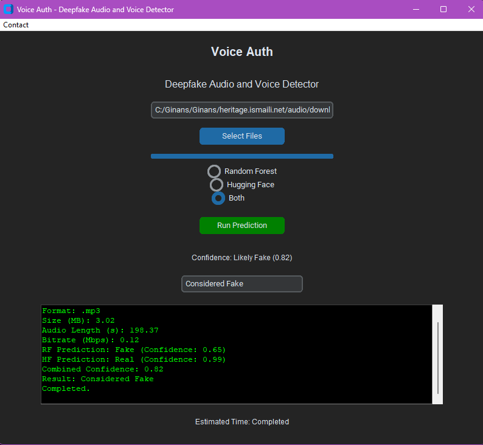

# Voice Auth: Deepfake Audio and Voice Detector
**Because every voice deserves to be real.**

Introducing **VoiceAuth**: Your Shield Against Deepfake Audio

🚀 **VoiceAuth** is here to redefine how we validate the authenticity of audio files. Whether you're a journalist, a business leader, or simply someone who values truth, VoiceAuth equips you with cutting-edge tools to detect and fight deepfake audio effortlessly.

## Who is it for?
🔊 **Media Professionals**: Ensure your audio content is credible and tamper-proof.  
🛡️ **Law Enforcement**: Authenticate voice recordings in investigations.  
📞 **Businesses**: Protect call centers and secure internal communications.  
🎓 **Educators & Researchers**: Dive into real-world machine learning and voice analytics.  
🔒 **Security Experts**: Enhance voice biometrics and authentication systems.

## Why VoiceAuth?
✅ **Detect Deepfakes with Precision**: Leverage advanced AI models, including **Random Forest** and **Hugging Face** technologies for superior accuracy.  
✅ **User-Friendly**: Intuitive interface tailored for both tech-savvy users and beginners.  
✅ **Fast & Reliable**: Real-time analysis with confidence scores, metadata extraction, and visual insights.  
✅ **Multi-Model Capability**: Use models like **Random Forest**, **Melody**, or **960h** individually or combine them for superior results.  
✅ **Portable & Secure**: Runs seamlessly on your system with no internet dependency for predictions.

## Transforming Industries!
🎙️ **Journalism**: Verify audio sources before publishing.  
⚖️ **Legal**: Strengthen audio evidence for court cases.  
📈 **Business**: Detect fake voice inputs in customer interactions.  
🔬 **Research**: Analyze voice patterns and expand your knowledge of machine learning.

## 💻 Ready to try VoiceAuth?
Download now and take control of your audio files. With VoiceAuth, truth and authenticity are always within reach.

## 💡 Support Us!
Love what VoiceAuth stands for? Help us grow by donating here:  
[Donate to VoiceAuth](https://www.paypal.com/donate/?business=sadiqkassamali@gmail.com&no_recurring=0&item_name=Support+VoiceAuth+Development&currency_code=USD)

🎉 **VoiceAuth** – Deepfake Audio and Voice Detection Made Simple.  
📧 Need assistance or want to collaborate? Reach out: [sadiqkassamali@gmail.com](mailto:sadiqkassamali@gmail.com)

---

## Overview

**VoiceAuth** is an advanced audio deepfake detection application designed to identify manipulated audio content. By utilizing cutting-edge machine learning models, this application processes audio files and provides insights into their authenticity. It supports multiple audio and video formats, converts them to WAV, and extracts essential features for analysis. The application is designed to be fast, reliable, and easy to use, with a built-in database for efficient metadata management. It runs on **Windows** and works offline for added security and privacy.




[Watch demo video](images%2FVoiceAuth.mp4)

---

## Features

- **Deepfake Detection**: Uses both a **Random Forest model** and a **Hugging Face pipeline model** to ensure accurate deepfake detection.
- **File Format Support**: Handles various audio formats (e.g., MP3, WAV, FLAC) and video formats (e.g., MP4, AVI) by converting them to WAV for analysis.
- **MFCC Visualization**: Visualizes **Mel-Frequency Cepstral Coefficients (MFCC)** features extracted from audio files, allowing for deeper insights.
- **Metadata Storage**: Logs important file metadata such as format, size, audio length, and prediction results into a SQLite database for easy tracking and comparison.
- **User-Friendly Interface**: Built with **customtkinter**, the app offers a sleek, modern, and intuitive user experience.
- **Batch Processing**: Enables users to upload and process multiple files at once, saving time during analysis.
- **Logging with Typewriter Effect**: Logs are displayed with a typewriter effect to enhance readability and user engagement.

---

## Installation

1. Clone this repository:
   ```bash
   git clone https://github.com/sadiqkassamali/voice-auth.git
   cd voice-auth
Install the required packages:
   ```bash
   pip install -r requirements.txt
   ```
3. Ensure that `ffmpeg` is installed and added to your system PATH for audio and video processing.
4. Have fun!
# [Buy Me Coffee](https://buymeacoffee.com/sadiqkassamali)
#[Donate to Support](https://www.paypal.com/donate/?business=sadiqkassamali@gmail.com&no_recurring=0&item_name=Support+VoiceAuth+Development&currency_code=USD)


